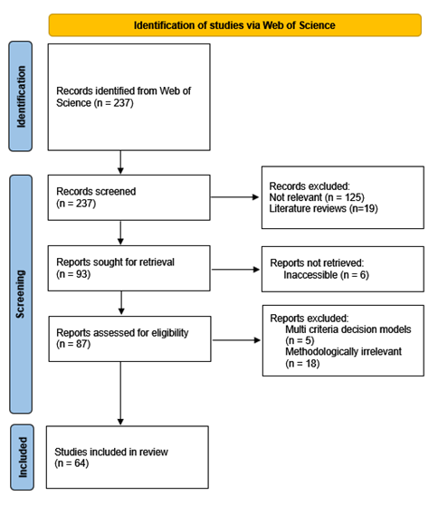

# CASN-CERS-in-Modelling-studies

This repository serves as supplementary material for the paper:

>**A Complex Adaptive Supply Network Perspective for Integrating Circular Economy, Resilience, and Sustainability in Healthcare Supply Chain Models

The paper used a narrative literature review approach to examine how existing HSC modelling studies conceptualise and integrate CERS, and to assess the extent to which these studies reflect CASN properties. 

## Authors

* **Fatemeh Alidoost**
   ORCID: https://orcid.org/0009-0000-0252-560X

* **Navonil Mustafee**
   ORCID: https://orcid.org/0000-0002-2204-8924

* **Thomas Monks**
   ORCID: https://orcid.org/0000-0003-2631-4481

* **Alison Harper**
   ORCID: https://orcid.org/0000-0001-5274-5037

### Table 1-A: Search strings

| **Search queries**	| **Keywords** 
|-----------------------|----------------------
| **Query 1. HSC-related**|	"supply chain" AND (healthcare OR pharma* OR medic*)| 
| **Query 2. CERS-related**|	resilien* OR disruption OR risk OR sustainabl* OR green OR "closed loop" OR closed-loop OR "circular economy" OR circular*|
|**Query 3. Modelling-related**| model* OR simulat*
Total (Query 1 AND Query 2 AND Query 3) | 237 |
|Search date: December 2025	

### Figure 1-A: PRISMA compliant workflow

Page, M. J., McKenzie, J. E., Bossuyt, P. M., Boutron, I., Hoffmann, T. C., Mulrow, C. D., ... & Moher, D. (2021). The PRISMA 2020 statement: an updated guideline for reporting systematic reviews. bmj, 372.

### Table 2-A: Inclusion/ exclusion criteria

|**Inclusion criteria**                     |	**Exclusion criteria**                      
|-------------------------------|--------------------
|HSC-related models	|Literature reviews      |
Incorporating at least one of the CERS concepts |	Pure qualitative models or pure multi criteria decision-making models (MCDMs)|
|Modelling (mathematical or simulation models)|	Non-English|
| Including at least one of the CERS concepts|	Inaccessible articles|

*Final dataset

The csv file named "LR dataset" contains final dataset for the purpose of the review.
